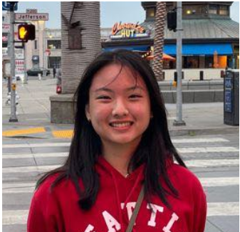

# Jennifer Tanurdjaja
## About Me
I am currently a **second-year Computer Science** major at UC San Diego.



>I think I've always been half out of my shell and half in. Sometimes I can be extremely wild and sometimes I can be extremely shy. It just depends on the day.

Here are some commands I used for this project:

```
git branch <branch name>
git checkout <branch name>
git status
```
You can find my LinkedIn [here](https://www.linkedin.com/in/jennifer-tanurdjaja/).

[About Me Section Link](#about-me)

[This is the relevant link](README.md)

## Relevant Courses
### Here is a list of classes that I have taken thus far:
- Discrete Mathematics
- Linear Algebra
- Advanced Data Structures

### Courses that I am currently taking are:
1. Software Engineering
2. Algorithms
3. Linguistics
4. Education Studies

## Goals for Today
- [x] Exercise
- [ ] Finish Homework
- [ ] Meet with friends    